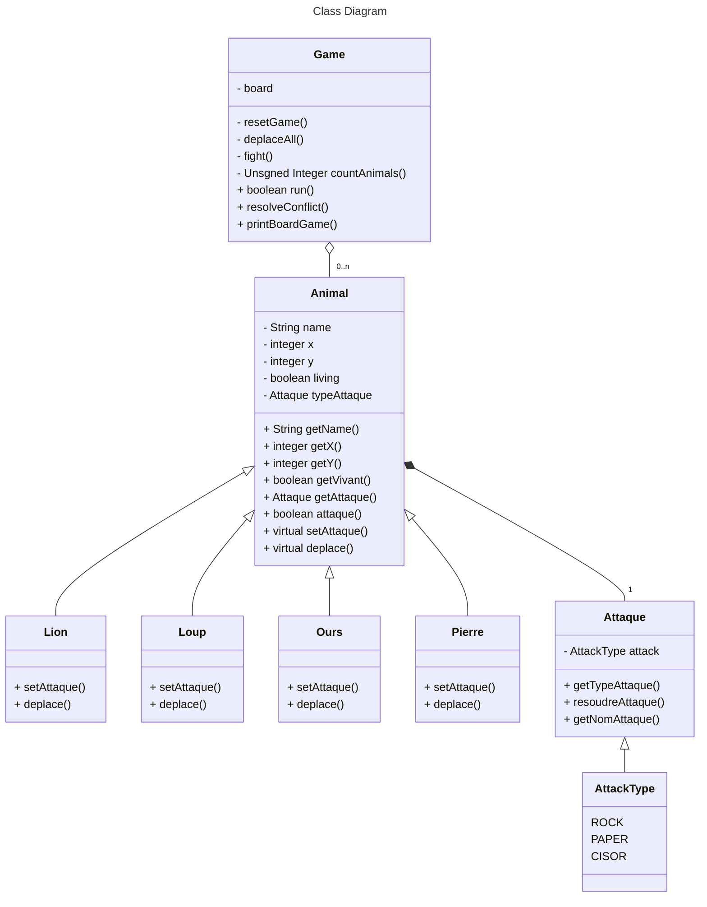

# Jack Nathan

## Diagramme de Classes



## Modification spec

### Type attaque

De base, le type d'attaque est défini par un int :  
`- int type // 0 :pierre, 1: Feuille, 2:Ciseaux`  
Cependant, cette manière de faire n'est pas très lisible dans le code, si l'on voit une variable de type int, elle peut correspondre à tout et n'immporte quoi, de plus le compilateur acceptes toutes assignations.  
La proposition est la suivante : Utiliser une enum class  
```c++
enum class AttaqueType {
    ROCK,
    PAPER,
    CISOR
};
```
L'utilisation de l'enum class permet de spécifier le types des variables contenant l'attaque, et de limiter les valeurs possible assigné à cette variable.  

